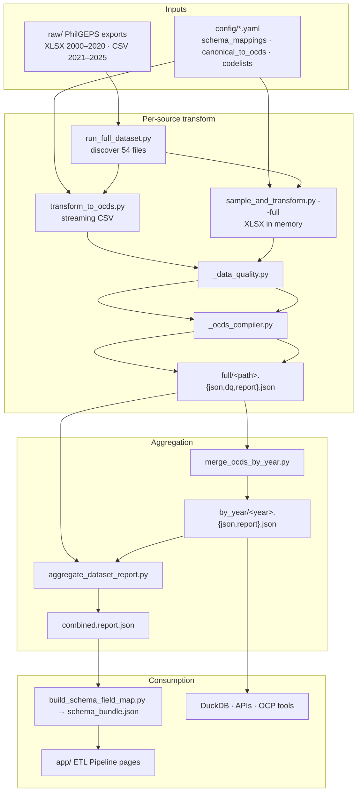

# PhilGEPS → OCDS data ETL pipeline

End-to-end reference pipeline for transforming PhilGEPS open-data exports (2000–2025) into **OCDS 1.1 release packages**, with layered data-quality reporting and calendar-year aggregation.

**Audience:** pipeline operators, analysts integrating `by_year/` outputs, and webapp maintainers embedding run statistics.

**Related:** [TRANSFORM.md](TRANSFORM.md) (single-file transform + DQ rules) · [VALIDATION.md](VALIDATION.md) (OCDS validation layers) · [OCDS_ID_GENERATION.md](OCDS_ID_GENERATION.md) (`ocid` / `release.id` policy) · [ARCHITECTURAL_DECISIONS.md](ARCHITECTURAL_DECISIONS.md) (ADR log — grouping, `ocid`, reports) · [SCHEMA_VERIFICATION_AND_MAPPING_RUN.md](SCHEMA_VERIFICATION_AND_MAPPING_RUN.md) (S1–S5 header verification)

---

## What this pipeline produces

After a full run on all PhilGEPS exports under `raw/`:

| Metric | Typical value |
|--------|----------------|
| Source files processed | 54 (CSV + XLSX) |
| Calendar years merged | 25 (2000–2025, no 2001) |
| OCDS releases (by year, deduped) | ~5.05 million *(pre–process-level regrouping; counts drop after ADR-009/011)* |
| Raw source rows inspected | ~17.6 million |
| On-disk OCDS JSON (`by_year/`) | ~20 GB |

Outputs are **local artifacts** under `references/transformed/` (gitignored in most setups). Only summary reports and the webapp bundle are regenerated into committed paths when you run `build_schema_field_map.py`.

---

## Architecture



---

## Pipeline stages

### Stage 0 — Raw inputs

Place PhilGEPS exports under the monorepo `raw/` tree (or symlink). Expected layout:

```
raw/
├── 2000-2012/                    # annual + semi-annual XLSX (S1)
├── PHILGEPS 2013-2021/           # quarterly XLSX (S1 through 2021)
├── PHILGEPS -- 2021-2025 (CSV)/  # yearly CSV (S3)
└── Misc/
    └── PHILGEPS -- 2021 - 2025 (CSV) V2/   # quarterly CSV (S4/S5)
```

Skipped automatically: empty files, `raw/SSP/`, `flood-control-projects.csv`.

### Stage 1 — Schema detection

Each file’s header row is matched against S1–S5 marker column sets (`transform_to_ocds.detect_schema()`):

| Schema | Markers |
|--------|---------|
| S1 | `UOM`, `Organization Name` |
| S2 | `Unit of Measurement`, `Organization Name` |
| S3 | `Procuring Entity`, `Created By`, `List of Bidder's` |
| S4 | `Procuring Entity (PE)`, `Region`, `Bid Notice Status` |
| S5 | Same 46-col V2 layout (often under `Misc/`) |

XLSX files use **header row 4** (0-based row 3). CSV files use row 0.

### Stage 2 — Column mapping

`config/schema_mappings.yaml` maps export column names → **53 canonical fields** for the detected schema.

Unmapped columns are listed in `.dq.json` / `.report.json` but dropped from compilation.

### Stage 3 — Data-quality gate

Every source row passes through `scripts/_data_quality.py`:

| Severity | Effect |
|----------|--------|
| `error` | Row **quarantined** — excluded from grouping |
| `warning` | Row compiled; issue logged |
| `info` | Logged; un-awarded tenders skip release emission |

After grouping by contracting process (`bid_reference_no`, else `solicitation_no` or `award_reference_no`), `validate_process_group()` adds cross-row checks (`group_field_conflict`, `duplicate_line_item_no`).

See [TRANSFORM.md](TRANSFORM.md) for the full rule list.

### Stage 4 — Group & compile

- Rows sharing a `bid_reference_no` collapse into one OCDS release (one `ocid`).
- When `bid_reference_no` is missing or `0` (common in S3/S4), rows fall back to grouping by `solicitation_no` or `award_reference_no`.
- Line items merge into `tender.items[]`; each distinct `award_reference_no` becomes an `awards[]` / `contracts[]` entry with its own items.
- `release.id` and `ocid` use **bid-first** display ids; solicitation is fallback; composite ids only on `(ocid, id)` collision — see [OCDS_ID_GENERATION.md](OCDS_ID_GENERATION.md).
- `scripts/_ocds_compiler.py` walks `config/canonical_to_ocds.yaml` staging rules.
- Shape pre-flight (`scripts/_ocds_checks.py`) runs before write.

### Stage 5 — Per-file outputs

Each raw export produces three sibling files under `references/transformed/full/`:

| File | Contents |
|------|----------|
| `<base>.json` | OCDS 1.1 release package |
| `<base>.dq.json` | Data-quality report (counts + capped samples) |
| `<base>.report.json` | **Unified report** — source DQ + shape pre-flight + optional libcoveocds |

Example:

```
references/transformed/full/
├── 2000-2012/Bid Notice and Award Details 2009.json
├── 2000-2012/Bid Notice and Award Details 2009.dq.json
├── 2000-2012/Bid Notice and Award Details 2009.report.json
├── PHILGEPS -- 2021-2025 (CSV)/2024.json          # ~1.7 GB, compact JSON
├── PHILGEPS 2013-2021/Bid Notice and Award Details Jan-Mar 2015.json
└── full_dataset_results.json                       # batch checkpoint
```

**CSV path:** `scripts/transform_to_ocds.py` (streaming — handles multi-GB files).

**XLSX path:** `scratch/sample_and_transform.py --full` (loads workbook via openpyxl).

Large packages (>200k releases) are written as **compact single-line JSON** to avoid `MemoryError` during `json.dumps`.

### Stage 6 — Calendar-year merge

`scripts/merge_ocds_by_year.py` combines quarterly XLSX and overlapping CSV sources into one package per calendar year:

```
references/transformed/by_year/
├── 2013.json              # 4 quarterly XLSX merged
├── 2013.report.json
├── 2021.json              # 2021.csv + Q1/Q2 2021 XLSX
├── 2024.json              # 2024.csv + Q4 V2 CSV (deduped by ocid)
├── 2025.json
├── by_year_index.json     # release counts + paths per year
└── ...
```

**Dedup rule:** within a year, later source files overwrite releases with the same `ocid`. Example: 2024 full-year CSV wins over the Q4 V2 quarterly export (~164k overwrites).

### Stage 7 — Combined dataset report

`scripts/aggregate_dataset_report.py` rolls up all per-file and per-year reports into one integration artifact:

```
references/transformed/combined.report.json
```

| Section | Purpose |
|---------|---------|
| `layers.source_dq` | Totals across all 54 source files (rows, severity, rules) |
| `years[]` | Per-year releases, MB, warnings, pass/fail |
| `source_files[]` | Slim index of every raw export |
| `summary` | `all_passed`, `finding_counts`, `top_findings` |
| `webapp` | Pointers to small sample files for bundle embed |
| `artifacts` | Paths to `by_year/`, `full/`, indexes |

This file is ~100 KB — safe to load in the webapp or a dashboard without touching multi-GB JSON.

Runs automatically at the end of `merge_ocds_by_year.py`.

---

## Commands

### Prerequisites

```bash
cd philgeps_schema_analysis
pip install -r requirements.txt
# optional, for libcoveocds validation on individual files:
pip install -r requirements-dev.txt
```

Raw data must be available at `../raw/` relative to this package (monorepo layout) or adjust paths in `run_full_dataset.py`.

### Full dataset (recommended)

After **compiler or identity policy changes**, run a **clean** transform (do not `--resume` over stale `full/` outputs). Archive or delete `references/transformed/full/` first.

```bash
python scripts/run_full_dataset.py --no-quiet
```

| Flag | Effect |
|------|--------|
| `--resume` | Skip files that already have `.report.json` (safe only when re-running the **same** compiler rules) |
| `--only "2024.csv"` | Process matching files only |
| `--dry-run` | List files without transforming |
| `--no-merge-by-year` | Skip year merge + combined report |
| `--run-ocds-validate` | Run libcoveocds per file (very slow) |

On completion: per-file outputs in `full/`, year packages in `by_year/`, `combined.report.json`, per-year `browser/` and `dq/` caches, checkpoint in `full/full_dataset_results.json`.

**Reference run (2026-06-28):** 54 sources → 25 calendar years → **3,611,852** deduplicated releases in `by_year/` (~20 GB on disk). Shape pre-flight passed; libcoveocds skipped in batch (spot-check with `validate_transform_sample.py`).

**Disk:** allow ~40 GB free (source JSON + year merges). **RAM:** peak ~8–16 GB on largest CSV years.

### Single file (development)

```bash
# CSV — streaming
python scripts/transform_to_ocds.py "../raw/PHILGEPS -- 2021-2025 (CSV)/2025.csv" \
  --out "references/transformed/full/PHILGEPS -- 2021-2025 (CSV)/2025"

# Quick sample
python scripts/transform_to_ocds.py "../raw/.../2025.csv" --sample 1000 \
  --out references/transformed/sample1k

# XLSX — full file
python scratch/sample_and_transform.py "../raw/PHILGEPS 2013-2021/Bid Notice and Award Details Jan-Mar 2015.xlsx" \
  --full --out "references/transformed/full/PHILGEPS 2013-2021/Bid Notice and Award Details Jan-Mar 2015"
```

### Re-merge or refresh reports only

```bash
# Rebuild all year packages (skips unchanged years with --resume)
python scripts/merge_ocds_by_year.py --resume

# Rebuild only 2024 and 2025
python scripts/merge_ocds_by_year.py --years 2024,2025 --resume

# Regenerate combined.report.json only
python scripts/aggregate_dataset_report.py
```

### Post-ETL (webapp and integrators)

After a full run (merge runs automatically at the end of `run_full_dataset.py`):

```bash
python scripts/build_schema_field_map.py   # embed combined.report.json → schema_bundle.json
cd app && npm run dev
```

`merge_ocds_by_year.py` already writes `by_year/browser/<year>.json` and `by_year/dq/<year>.json`. Rebuild manually only if needed:

```bash
python scripts/build_year_browser_cache.py
python scripts/build_year_dq_cache.py
```

Optional spot validation:

```bash
python scripts/validate_transform_sample.py "references/transformed/by_year/2004.json"
```

### Webapp embed

```bash
python scripts/build_schema_field_map.py   # reads combined.report.json if present
cd app && npm run dev
```

The **ETL Pipeline** section shows:

- **Pipeline overview** — run summary and by-calendar-year table when `combined.report.json` is embedded
- **Year data quality** — per-year DQ from `by_year/dq/<year>.json` (fresh samples with row context; see [ADR-013](ARCHITECTURAL_DECISIONS.md#adr-013-year-vs-corpus-data-quality))
- **Corpus data quality** — dataset-wide roll-up from `combined.report.json`
- **Release browser** — `#/etl-releases/{year}` and `#/etl-releases/{year}/{ocid}`; searchable sidebar, Summary tab, Raw JSON on demand

Per-year caches: `references/transformed/by_year/browser/<year>.json`, `by_year/dq/<year>.json`. Dev server (`vite.config.ts`): `/data/releases/{year}.json`, `/data/dq/{year}.json`, `/data/release/{year}/{ocid}.json`; CORS for `https://ocdsphilgeps.simple-systems.dev` when tunneling.

---

## Report formats

### Unified per-file report (`.report.json`)

Produced by `scripts/_unified_report.py` for every transform:

```json
{
  "report_version": "1",
  "input_file": "...",
  "schema_detected": "schema_3",
  "compiled_release_count": 481329,
  "layers": {
    "source_dq": { "rows_seen", "severity_counts", "rule_counts", "samples..." },
    "shape_preflight": { "passed", "issue_count" },
    "ocds_validation": { "available", "passed", "..." }
  },
  "summary": { "all_passed", "finding_counts", "top_findings" }
}
```

Full-dataset runs skip libcoveocds (`--skip-ocds-validate`) for speed; shape pre-flight still runs.

### Per-year report (`by_year/<year>.report.json`)

Aggregates DQ stats from all source packages contributing to that year. Same schema as above plus `calendar_year`, `source_files[]`, and `duplicate_ocids_overwritten`.

### Combined report (`combined.report.json`)

Dataset-wide roll-up. Use this for:

- Dashboard headline metrics
- Webapp `schema_bundle.json` embed
- CI gates on aggregate quarantine counts
- Year-over-year DQ comparison via `years[]`

**Note:** `compiled_release_count` sums by-year deduplicated releases. `compiled_release_count_sources` sums per-file counts before cross-file/year dedup (~5.34M) — useful for reconciling against raw row grouping.

---

## Logs and checkpoints

| Path | Contents |
|------|----------|
| `references/transformed/logs/run_full_dataset.log` | Batch stdout (may buffer; trust `.report.json` counts) |
| `references/transformed/full/full_dataset_results.json` | Per-file status, elapsed time, top findings |

Resume logic skips any file where `full/<rel>.report.json` already exists with `status: ok` in the checkpoint **or** on disk.

---

## Known limitations

| Limitation | Detail |
|------------|--------|
| Not a live OCDS publisher | `uri` / `publishedDate` are placeholders |
| Cross-file dedup | Only within calendar-year merge (by `ocid`) |
| libcoveocds on full run | Skipped by default; validate samples manually |
| XLSX in memory | Very large quarters need sufficient RAM |
| Un-awarded tenders | Excluded from release output (logged as info) |
| Production scale | No record package, API, or incremental delta sync |

---

## Using the outputs

### Analysis entry points

```
One calendar year          →  by_year/2023.json
One raw export             →  full/PHILGEPS -- 2021-2025 (CSV)/2023.json
DQ stats only              →  combined.report.json  or  by_year/2023.report.json
Programmatic year index    →  by_year/by_year_index.json
```

### Example — load combined report

```python
import json
from pathlib import Path

report = json.loads(
    Path("references/transformed/combined.report.json").read_text(encoding="utf-8")
)
print(report["compiled_release_count"])       # ~5_051_706
print(report["layers"]["source_dq"]["rows_seen"])
for y in report["years"]:
    print(y["year"], y["compiled_release_count"], y["package_mb"])
```

Large year files should be queried with **streaming JSON** (ijson) or **DuckDB** — do not `json.loads()` multi-GB files in memory.

---

## Script reference

| Script | Role |
|--------|------|
| `run_full_dataset.py` | Batch driver: all raw files → `full/` → merge → combined report |
| `transform_to_ocds.py` | CSV streaming transform |
| `scratch/sample_and_transform.py` | XLSX sample/full transform |
| `merge_ocds_by_year.py` | Quarterly → calendar year packages |
| `aggregate_dataset_report.py` | Build `combined.report.json` |
| `build_schema_field_map.py` | Embed combined stats into webapp bundle |
| `_data_quality.py` | Row/group validation rules |
| `_ocds_compiler.py` | Canonical → OCDS release |
| `_unified_report.py` | Merge DQ + shape + libcoveocds into `.report.json` |
| `_ocds_checks.py` | OCDS shape pre-flight |
| `_ocds_validate.py` | libcoveocds wrapper |

---

## See also

- [TRANSFORM.md](TRANSFORM.md) — DQ rules, grouping semantics, iteration workflow
- [VALIDATION.md](VALIDATION.md) — validation layers and `validate_transform_sample.py`
- [GETTING_STARTED.md](GETTING_STARTED.md) — clone, webapp, single-file transform
- [../references/README.md](../references/README.md) — artifact index including transformed outputs
